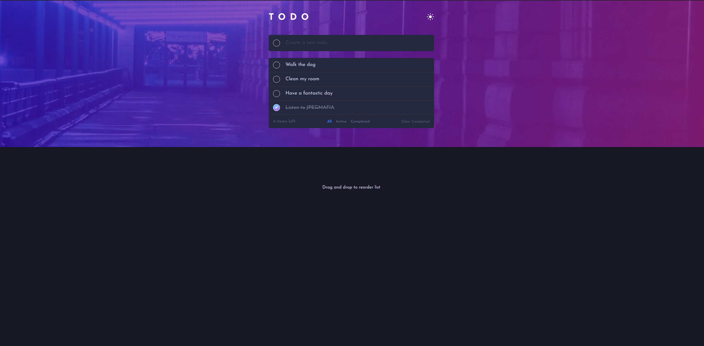

# React Todo Web Application

This project was bootstrapped with [Create React App](https://github.com/facebook/create-react-app).

This project is a challenge created by [FrontEndMentor](https://www.frontendmentor.io/challenges/todo-app-Su1_KokOW/hub/todo-app-uwOh3yUJA). The challenge was to create a simple todo app with theme switching and drag and drop functionality. I had previously completed the challenge before, but wanted to try it again with my knewly found knowledge and React, TypeScript, and Styled Components.

Some Improvements that will be made in the future

- UseContext to better handle passing down props and methods to each Todo Item.
- Hover states on Todo items when they are dragged and hovered over.
